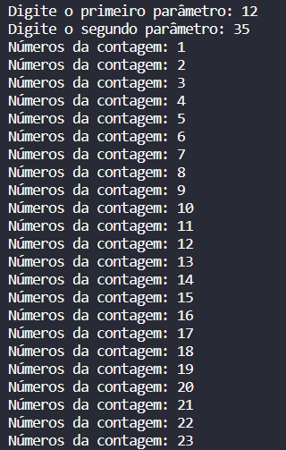
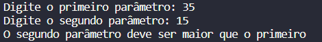

<h1 align="center"> DIO - Trilha Java Básico Desafio </h1>

   
Desenvolvido por:
 Mislene Moura - [Linkedin](https://www.linkedin.com/in/mislene-silva-moura-1211531b4//) |
   [Github](https://github.com/MisleneSM)

## Índice

* [1. Resumo do projeto](#1-resumo-do-projeto)
* [2. Resultado Final](#2-resultado-final)
* [3. Tecnologias Utilizadas](#3-tecnologias-utilizadas)

***

## 1. Resumo do Projeto🤩

Desenvolvido um mini projeto tendo como principal objetivo trabalhar com a linguagem Java, recebendo parâmetros via terminal e obtendo a quantidade de interações. Desafio promovido pela [Dio](https://www.dio.me/) do curso de Formação Java Developer, administrada pelo professor [Gleyson Sampaio](https://github.com/glysns)

Sobre o desafio:

Exercitando todo o conteúdo apresentado sobre Controle de Fluxo.

O sistema deverá receber dois parâmetros via terminal que representarão dois números inteiros, com estes dois números você deverá obter a quantidade de interações (for) e realizar a impressão no console (System.out.print) dos números incrementados, exemplo:

* Se você passar os números 12 e 30, logo teremos uma interação (for) com 18 ocorrências para imprimir os números, exemplo: "Imprimindo o número 1", "Imprimindo o número 2" e assim por diante.
* Se o primeiro parâmetro for MAIOR que o segundo parâmetro, você deverá lançar a exceção customizada chamada de ParametrosInvalidosException com a segunda mensagem: "O segundo parâmetro deve ser maior que o primeiro"

1. Crie o projeto `DesafioControleFluxo`
2. Dentro do projeto, crie a classe `Contador.java` para realizar toda a codificação do nosso programa.
3. Dentro do projeto, crie a classe `ParametrosInvalidosException` que representará a exceção de negócio no sistema.

## 2. Resultado Final✅

### Sem exceção

### Com exceção

## 3. Tecnologias Utilizadas✅ 

